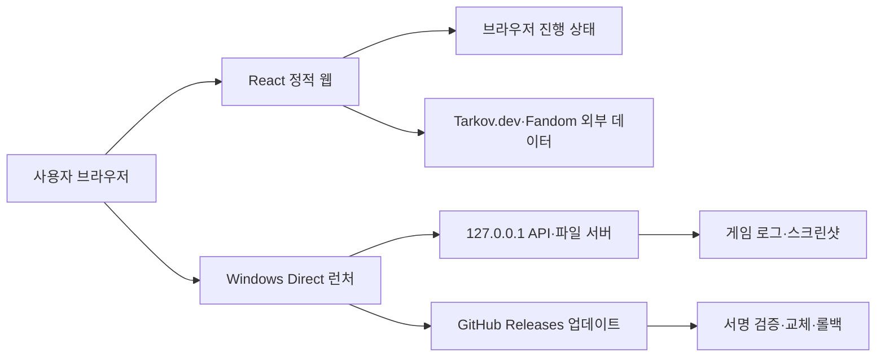

# Tarkov Helper Web 다중 사용자 배포·웹 플랫폼 위험 종합 조사

- 조사 기준일: 2026-08-14 KST
- 조사 대상: React/Vite 정적 웹, Windows Direct/localhost 런처, 자체 업데이트, 스크린샷 추적기, Tarkov.dev·TarkovData·Fandom 연동
- 코드 스냅샷: `package.json` 1.0.32, `v1.0.31-7-g5421891-dirty`
- 공개 배포 스냅샷: 조사 시점 GitHub 최신 공개판은 immutable `v1.0.31`
- 조사 방법: 저장소 정적 감사, 기존 테스트·빌드 결과 검토, MDN/W3C/web.dev/React/Vite/Playwright/Microsoft/OWASP/GitHub/TUF/MediaWiki/Fandom/Tarkov.dev 1차 자료 비교
- 주의: 보안·법률 항목은 위험 식별 자료이며 법률 자문이나 인증 판정이 아니다.

## 1. 결론 요약

이 프로젝트는 단순 홈페이지가 아니다. 하나의 제품 안에 다음 다섯 시스템이 겹쳐 있다.

따라서 실제 다중 사용자 장애의 중심은 UI 코드만이 아니다. 가장 큰 잔여 위험은 다음 순서다.

1. **사용자 진행 상태의 내구성**: 버전 migration, 원본 격리, backup/import/export, 다중 탭 충돌 해결이 아직 없다.
2. **Windows 배포 신뢰**: 패키지 RSA 서명은 강하지만 EXE/PowerShell 자체가 Authenticode publisher 신뢰를 얻지 못해 SmartScreen, WDAC, AppLocker, 기업 EDR에서 막힐 수 있다.
3. **업데이트 신뢰의 장기 운영**: 단일 장기 키가 훼손되거나 정상 회전해야 할 때 기존 설치를 자동으로 안전하게 이동시키는 trust-root rotation 절차가 없다.
4. **데이터 최신성·계약·권리 증빙**: 외부 데이터가 오래되거나 schema가 변해도 release를 막는 freshness/coverage gate가 없고, 번들 자산별 출처·라이선스 증빙도 없다.
5. **브라우저·접근성·성능 검증 폭**: Chromium 중심 테스트, WCAG 명암 문제, 대형 JSON과 단일 앱 chunk, 전 응답 `no-store`, Core Web Vitals budget 부재가 남아 있다.
6. **운영 가시성**: 로컬 진단 로그는 잘 보강됐지만, 여러 사용자의 반복 장애를 자동으로 집계할 opt-in 운영 신호와 계층 간 correlation ID가 없다.

현재 코드의 좋은 점도 분명하다. 업데이트 서명·ZIP 방어·rollback/repair, localhost Host/Origin/token 경계, 민감정보 제거 진단 로그, PiP/팝업 fallback, 스크린샷 자동 지도 전환 등은 일반 개인 프로젝트보다 강하다. 보고서의 목적은 이를 다시 문제로 세는 것이 아니라, **이미 해결된 층 위에 아직 비어 있는 층**을 보여 주는 것이다.

## 2. 우선순위 정의

| 등급 | 의미 |
|---|---|
| P1 | 여러 사람에게 일반 배포하기 전 해결하거나, 명시적으로 지원 대상에서 제외해야 하는 항목. 상태 손실·실행 차단·신뢰 체인·권리 문제가 중심이다. |
| P2 | 다음 1~2개 개발 주기 안에 해결해야 하는 높은 확률의 호환성·가용성·접근성·성능 문제. |
| P3 | 즉시 차단은 아니지만 지원 비용과 장기 유지보수 비용을 키우는 항목. 모니터링·문서·회귀 테스트 대상으로 관리한다. |

등급은 “코드가 나쁘다”는 뜻이 아니다. 예를 들어 WDAC 환경을 공식 지원하지 않기로 결정하면 구현 P1이 아니라 **문서화된 지원 경계**가 될 수 있다.

## 3. 조사한 코딩·표준 사이트의 관점 비교

| 자료군 | 강점과 주요 기준 | 이 프로젝트에 주는 결론 |
|---|---|---|
| [MDN Web Docs](https://developer.mozilla.org/) | 브라우저 API, storage, cache, secure context, viewport, image, page lifecycle의 실제 동작 | localStorage는 동기·best-effort이며 private mode/eviction 대비가 필요하다. 127.0.0.1은 potentially trustworthy지만 브라우저 정책 변화는 계속 추적해야 한다. |
| [W3C WCAG 2.2](https://www.w3.org/TR/WCAG22/) | 접근성 성공 기준을 테스트 가능한 규칙으로 정의 | 기본 overflow smoke만으로는 충분하지 않다. 명암, 200% 확대, 320 CSS px reflow, 언어 구분, keyboard/screen reader 검증이 필요하다. |
| [web.dev Core Web Vitals](https://web.dev/articles/vitals) | 실제 사용자의 LCP·INP·CLS 75 percentile 기준 | 기능 테스트와 별개로 성능 budget이 있어야 한다. 권장 good 기준은 LCP 2.5초, INP 200ms, CLS 0.1 이하다. |
| [React](https://react.dev/reference/react/lazy)·[Vite](https://vite.dev/guide/build) | route/code splitting, production target, modern browser 범위 | Vite 8 기본 target과 실제 지원 브라우저를 문서화해야 하며, 모든 페이지 정적 import는 초기 비용을 키운다. |
| [Playwright](https://playwright.dev/docs/test-projects) | Chromium·Firefox·WebKit·모바일·접근성 자동 검사 | Direct 전용 Chromium suite와 hosted-web 3-engine suite를 분리하는 것이 적절하다. Chromium 한 종류만으로 Edge 정책·Firefox·Safari를 대변할 수 없다. |
| [Microsoft Learn](https://learn.microsoft.com/en-us/windows/) | SmartScreen, Authenticode, ARM64, AppLocker/WDAC, CFA, long path, proxy/TLS | 자체 업데이트 RSA 서명과 Windows publisher 서명은 다른 문제다. 불특정 사용자 배포에는 Authenticode와 실제 소비자 Windows 보안 정책 검증이 필요하다. |
| [OWASP Cheat Sheet](https://cheatsheetseries.owasp.org/) | CSP, logging, file upload, CSRF, supply-chain defense-in-depth | 현재 localhost 인증 경계와 로그 redaction은 강점이다. CSP 전체 정책, 입력 크기 제한, dependency gate가 다음 층이다. |
| [TUF](https://theupdateframework.github.io/specification/v1.0.33/)·[SLSA](https://slsa.dev/spec/v1.2/build-requirements) | 키 회전·폐기, rollback/freeze/mix-and-match 방어, 빌드 provenance | 현재 패키지 무결성은 강하지만 단일 키 수명주기·highest-seen/freeze·threshold/offline root가 비어 있다. |
| [GitHub Docs](https://docs.github.com/en/code-security) | attestations, SBOM, dependency review, REST rate limits | attestation은 생성뿐 아니라 검증해야 한다. unauthenticated release API는 공유 IP 기준 60회/시간 제한이 있어 기업 NAT를 고려해야 한다. |
| [MediaWiki API Etiquette](https://www.mediawiki.org/wiki/API:Etiquette/en) | contact 가능한 User-Agent, batching, caching, `maxlag`, 과부하 회피 | 현재 Fandom 수집기의 concurrency·재시도·cache·maxlag 정책을 개선해야 한다. |
| [Fandom Licensing](https://www.fandom.com/licensing) | 텍스트와 이미지의 재사용 권리 범위가 다름 | 텍스트는 통상 CC BY-SA 조건을 따르지만 이미지가 자동으로 같은 라이선스가 되는 것은 아니다. 파일별 증빙이 필요하다. |
| [Tarkov.dev](https://tarkov.dev/api)·[tarkov-api](https://github.com/the-hideout/tarkov-api)·[TarkovData](https://github.com/TarkovTracker/tarkovdata/) | 커뮤니티 게임 데이터와 GraphQL/schema 제공 | 유용하지만 공식 게임 SLA가 아니다. schema adapter, snapshot provenance, stale/partial-outage 정책을 제품이 소유해야 한다. |

Stack Overflow, Reddit, 일반 블로그는 증상 발견에는 유용하지만 제품 지원 기준이나 보안 판단의 근거로는 사용하지 않았다. 서로 충돌할 때는 표준·브라우저 공급자·운영 서비스의 공식 문서를 우선했다.

## 4. 조사 시점 제품 규모

| 항목 | 측정값 |
|---|---:|
| `public/` 전체 | 544 files / 15,421,492 bytes |
| `public/assets/` | 539 files / 4,876,117 bytes |
| 핵심 `tarkov-data.json` | 4,821,748 bytes |
| `item-price-catalog.json` | 5,112,374 bytes |
| `quest-wiki-guides.json` | 610,957 bytes |
| 아이템 번들 이미지 | 475 files |
| 지도 SVG | 12 files |
| 은신처 이미지 | 26 files |
| 감사 시 production 앱 chunk | 약 495 KB raw / 144 KB gzip |
| 감사 시 CSS | 약 96 KB raw / 17 KB gzip |

이 수치는 “파일이 너무 크다”는 단정이 아니라, 느린 CPU·백신 실시간 검사·모바일 브라우저·재방문 cache 정책에서 별도 budget이 필요하다는 근거다.

## 5. 이미 해결되었거나 강하게 방어된 항목

아래는 이번 보고서에서 새 결함으로 세지 않는다. 단, 작업 트리에만 있고 공개 v1.0.31에 없는 변경은 배포 후에야 사용자 보호가 된다.

| 영역 | 현재 방어 |
|---|---|
| 업데이트 출처 | GitHub repository/API/host, signing key ID, RSA-3072 공개키 pin |
| 패키지 무결성 | manifest/signature/hash, immutable release·asset ID·digest 결합 |
| ZIP 방어 | traversal, ADS, reparse, 대소문자 collision, zip bomb, signed tree hash 검증 |
| 적용 복구 | bounded download/move retry, journal, nonce health check, rollback, fail-forward, cleanup |
| 상태 복구 | 손상 `instance.json`의 bounded read, reparse 거부, 안전 quarantine, 실행 중 instance 인증 |
| 구버전 업그레이드 | 오래된 버전 실제 update E2E와 별도 새 폴더 bootstrap 안내, pre-swap lock 재시도 상태 보존 |
| localhost 웹 경계 | loopback bind, exact `Host`, `Origin`, `Sec-Fetch-Site`, opaque token, no permissive CORS |
| 진단 로그 | browser bounded ring, 민감정보/path/token redaction, portable 1 MiB rotation, fail-open logging, 명시적 export |
| 오류 기록 | React/global/update/native/tracker/data/import 오류의 sanitized diagnostic 연결 |
| 퀘스트 창 | 동기 `window.open`, popup block 시 dock fallback, 네이티브 overlay 충돌 방지 |
| 미니맵 PiP | 기능 감지, pagehide/Escape cleanup, API 미지원·거절 fallback |
| 스크린샷 자동 위치 | map identity, 최신 이벤트 우선, launcher instance epoch, log rotation/partial line/bootstrap pending 처리 |
| 기본 반응형 | 320/768/1024/1440 기본 overflow smoke와 일부 safe-area 처리 |
| Wiki 이미지 privacy 완화 | lazy loading, `no-referrer`, 실패 fallback |
| CI 기본기 | full-SHA Actions pin, frozen lockfile, Windows Server 2022/2025 일부 E2E, artifact attestation 생성 |

## 6. 잔여 위험 상세

### 6.1 사용자 진행 상태·브라우저 저장소

#### F01 · P1 — 상태 schema 불일치나 JSON 손상 시 원본을 잃을 수 있음

- 근거: `src/app/store.tsx:27-29,530-558,570-611`은 `APP_STATE_VERSION = 1`만 수용하며 parse/version 실패 시 default state를 반환한다. 이후 layout effect가 default를 다시 저장할 수 있다.
- 위험: 아주 오래된 버전에서 새 버전으로 건너뛰거나 부분 손상된 storage를 만나면 퀘스트·아이템·지도 진행이 조용히 초기화될 수 있다.
- 조치: `v1 -> v2 -> ...` 순차 migration, raw 원본 quarantine, last-known-good, checksum, migration dry-run, 성공 후에만 원본 교체.
- 합격 기준: 지원했던 모든 공개 version fixture를 현재 version으로 direct-upgrade하고 진행 데이터 100% 보존. 손상 fixture는 기본값으로 덮지 않고 복구 파일을 제공.

#### F02 · P1 — 진행 상태 backup/export/import가 없음

- 핵심 진행의 유일한 사본이 origin별 `localStorage`다. 진단 JSON download는 사용자 진행 backup이 아니다.
- [MDN storage 문서](https://developer.mozilla.org/en-US/docs/Web/API/Storage_API/Storage_quotas_and_eviction_criteria)는 Web Storage가 best-effort이며 private mode 종료나 storage pressure에서 달라질 수 있음을 설명한다.
- 조치: 제품·schema version, 생성 시각, checksum, source origin을 포함한 진행 JSON export/import. update 직전 자동 backup, import preview, merge/replace 선택, 실패 시 무변경.
- 합격 기준: Chrome/Edge/Firefox, normal/private, 1.0.31 fixture→현재 version에서 export/import round trip이 byte-equivalent한 논리 상태를 복원.

#### F03 · P1 — 여러 탭에서 서로 다른 진행 변경이 last-write-wins로 사라질 수 있음

- 근거: `store.tsx:570-585`는 전체 state blob을 동기 저장한다. 현재 snapshot 보호는 두 탭 모두 수정한 경우의 충돌을 해결하지 않는다.
- [MDN `storage` event](https://developer.mozilla.org/en-US/docs/Web/API/Window/storage_event)와 [Web Locks](https://developer.mozilla.org/en-US/docs/Web/API/Web_Locks_API)를 조합하거나, revision/CAS·operation log를 사용할 수 있다.
- 조치: revision, writer ID, operation/field merge, conflict UI. 최소 대안은 한 origin에서 단일 writer를 강제하고 두 번째 탭을 read-only로 표시.
- 합격 기준: 두 page가 서로 다른 PVP/PVE/아이템을 동시에 변경해도 모두 보존. 같은 field 충돌은 deterministic하며 사용자에게 알려짐.

#### F04 · P2 — 쓰기 성공 뒤의 eviction/private-session 소실을 감지하지 못함

- 현재 `setItem` 예외 경고는 quota/blocked write에는 유효하지만 브라우저가 나중에 origin 데이터를 제거하는 상황은 감지할 수 없다.
- 조치: 저장 지속성 상태 표시, `navigator.storage.persisted()`/`persist()`는 보조로 사용, 정기 backup reminder, 마지막 성공 snapshot hash 표시.
- 합격 기준: InPrivate 종료, 브라우저 데이터 삭제, quota pressure를 support 문서와 UI가 구분해 설명.

#### F05 · P2 — 모든 상태 변경이 동기 JSON 직렬화와 Web Storage 쓰기를 유발

- Web Storage는 동기 API다. 큰 상태에서 연속 토글은 INP를 악화시킬 수 있다.
- 조치: batch/debounce, immutable change log, IndexedDB 비교. 단, `visibilitychange/pagehide` flush와 crash 내구성을 같이 설계해야 한다.
- 합격 기준: 최대 fixture에서 100회 연속 토글 시 main-thread long task와 INP budget 통과.

#### F06 · P2 — 상태가 scheme/host/port에 묶임

- [MDN storage quota](https://developer.mozilla.org/en-US/docs/Web/API/Storage_API/Storage_quotas_and_eviction_criteria)는 origin을 scheme+host+port로 정의한다. Direct 포트나 hosted domain이 바뀌면 같은 PC에서도 별도 state가 된다.
- 조치: 고정 origin을 제품 계약으로 유지하거나, 서명된 export/import 및 one-time origin migration 제공.

#### F07 · P3 — 진단은 로컬에 잘 남지만 다수 사용자 패턴은 보이지 않음

- 자동 raw upload를 하지 않는 현재 설계는 privacy 강점이다. 반면 운영자는 “특정 GPU/OS/브라우저에서 20% 실패” 같은 fleet 패턴을 알 수 없다.
- 조치: 별도 동의 기반 최소 telemetry 또는 사용자가 미리 확인하는 통합 support bundle. raw logs·토큰·경로 자동 전송은 금지.

### 6.2 Windows 배포·기업 보안·플랫폼 차이

#### F08 · P1 — Authenticode publisher 신뢰 부재

- 현재 package RSA signature는 updater authorization이다. Windows가 EXE publisher를 신뢰하는 Authenticode와는 다르다.
- [Microsoft SmartScreen](https://learn.microsoft.com/en-us/windows/apps/package-and-deploy/smartscreen-reputation)은 publisher와 file reputation을 사용하며 unsigned 새 hash는 릴리스마다 평판을 다시 쌓을 수 있다.
- 조치: EXE와 배포 가능한 script/catalog를 Authenticode 서명하고 RFC3161 timestamp. 서명 인증서 보호·회전·폐기 절차도 문서화.
- 합격 기준: 브라우저 다운로드→MOTW 유지→Explorer 압축 해제 후 `Get-AuthenticodeSignature` valid, publisher/timestamp 일치. SmartScreen UX를 실제 clean VM에서 기록.

#### F09 · P1 또는 명시적 미지원 — WDAC/AppLocker/PowerShell CLM 구조 충돌

- 모든 entry point가 Windows PowerShell 5.1 `-ExecutionPolicy Bypass`를 사용하고 worker/broker가 `Add-Type`과 .NET 호출에 의존한다.
- [PowerShell App Control](https://learn.microsoft.com/en-us/powershell/scripting/security/app-control/how-app-control-works?view=powershell-7.6)에서 untrusted script는 Constrained Language Mode가 될 수 있다. `Bypass`는 조직 App Control을 우회하지 못한다.
- 선택지: publisher-signed/native updater 구조로 기업 지원, 또는 WDAC/AppLocker Enforce 환경을 공식 미지원으로 사전 감지·명확히 안내.

#### F10 · P1 — update signing key 회전·폐기 bridge 부재

- worker는 현재 key와 staged key를 동일하게 요구한다. 정상 rotation도 기존 fleet에 전달할 수 없고 compromise 복구는 수동 bootstrap이 된다.
- [TUF key management](https://theupdateframework.github.io/specification/v1.0.33/#key-management-and-migration)처럼 old+new cross-sign transition, versioned trust root, offline/threshold root를 검토한다.
- 합격 기준: key N client가 중간 bridge를 거쳐 N+1을 신뢰하고, rotation 완료 뒤 old-key-only release를 거부. compromise drill의 RTO/RPO가 문서화됨.

#### F11 · P1 — 장기 단일 RSA private key가 Actions hosted runner 환경변수에 노출

- signer job isolation/no-checkout은 강점이지만 workflow나 environment 승인 탈취 시 키 유출 위험이 fleet 전체에 미친다.
- 조치: 2인 승인, egress 최소화, managed/HSM signing 또는 offline threshold signer, 정기 rotation/incident drill.
- [SLSA build requirements](https://slsa.dev/spec/v1.2/build-requirements)와 TUF role separation을 설계 기준으로 삼는다.

#### F12 · P2 — Defender Controlled Folder Access·EDR에서 portable update가 막힐 수 있음

- Documents/OneDrive KFM 같은 보호 폴더에서 PowerShell의 stage/sibling rename/write가 차단될 수 있다. blanket `powershell.exe` 허용은 지나치게 넓다.
- [Microsoft CFA](https://learn.microsoft.com/en-us/defender-endpoint/controlled-folders)는 허용 앱과 보호 폴더 정책을 별도로 다룬다.
- 조치: 짧고 user-only ACL인 권장 LocalAppData 설치 위치, publisher-signed helper, CFA/EDR 실제 Block mode test. 실패 시 swap 전 중단하고 원본 보존.

#### F13 · P2 — Windows 지원표가 OS 보안 수명과 맞지 않을 수 있음

- [Windows 10 Home/Pro lifecycle](https://learn.microsoft.com/en-us/lifecycle/products/windows-10-home-and-pro)에 따르면 일반 22H2 지원은 2025-10-14 종료됐다.
- 조치: Win11 지원, Win10 ESU/LTSC 제한 지원, 비-ESU Win10 “호환 가능하지만 보안 지원 안 함”을 분리 표기.

#### F14 · P2 — ARM64 end-to-end 검증이 없음

- AnyCPU launcher와 x64 emulation이 가능해도 EXE→PowerShell→Add-Type→update/rollback 전 경로는 실제 Win11 ARM64에서 확인해야 한다.
- [Windows on Arm](https://learn.microsoft.com/en-us/windows/arm/add-arm-support) 문서대로 native/emu 조합과 프로세스 architecture를 기록한다.

#### F15 · P2 — long path는 EXE manifest 하나로 전체 체인이 해결되지 않음

- `TarkovHelperLauncher.manifest`의 `longPathAware`는 child `powershell.exe`와 .NET Framework I/O를 자동으로 바꾸지 않는다.
- [Microsoft long path](https://learn.microsoft.com/en-us/windows/win32/fileio/maximum-file-path-limitation)는 OS policy와 각 process manifest가 모두 관련됨을 설명한다.
- 현재 짧은 새 폴더 안내는 적절한 support boundary다. 240/259/260/320자와 policy on/off를 별도 시험한다.

#### F16 · P2 — proxy 동작이 updater와 가격 bridge에서 비대칭

- updater는 `DefaultWebProxy`와 credentials를 사용하지만 가격 bridge는 명시적 proxy 비활성 경로가 있어 proxy-only/PAC/407 환경에서 일부 기능만 실패할 수 있다.
- 조치: system proxy/PAC/NTLM 정책 통일, localhost는 proxy bypass, 허용 redirect host 유지.

#### F17 · P2 — TLS certificate revocation 정책이 명시되지 않음

- TLS 1.2와 package signature는 강점이지만 .NET Framework의 CRL check 기본값/기업 TLS inspection 동작을 제품이 정의해야 한다.
- [CheckCertificateRevocationList](https://learn.microsoft.com/en-us/dotnet/api/system.net.servicepointmanager.checkcertificaterevocationlist?view=netframework-4.8.1)와 CRL offline 시 동작을 시험한다.

#### F18 · P2 — package/state ACL owner 검증과 path-based TOCTOU 잔여

- reparse/ZIP 검증은 강하지만 user-writable 공유 parent에서 다른 principal이 쓸 수 있으면 검증 후 junction/path swap 위협이 커진다.
- 조치: owner/DACL fail-closed, handle-based identity, 권장 설치 위치 강제 또는 경고.

#### F19 · P3 — PowerShell 5.1에서 `$IsWindowsPlatform` 분기 dead path 가능성

- `portable/launcher.ps1:4777`은 저장소에서 별도 정의되지 않은 `$IsWindowsPlatform`을 검사한다. Windows PowerShell 5.1에서는 기본 변수가 아니어서 Edge/Chrome 명시 탐색이 생략될 수 있다.
- 서버 자체는 동작하나 기본 handler가 오래되거나 조직 정책으로 다른 브라우저일 수 있다. 실제 PS5.1에서 unit/integration test로 고정한다.

### 6.3 웹 보안·브라우저 호환성·PiP

#### F20 · P2 — CSP가 framing만 막고 script/connect/object/base를 제한하지 않음

- `portable/launcher.ps1:1229`의 CSP는 `frame-ancestors 'none'`만 포함한다.
- [OWASP CSP Cheat Sheet](https://cheatsheetseries.owasp.org/cheatsheets/Content_Security_Policy_Cheat_Sheet.html)는 header 기반 strict CSP를 report-only로 검증한 뒤 enforce할 것을 권장한다.
- 조치 예: `default-src 'self'; script-src 'self'; style-src 'self'; img-src 'self' https://static.wikia.nocookie.net data:; connect-src 'self' ...; object-src 'none'; base-uri 'none'; form-action 'self'; frame-ancestors 'none'`. 실제 필요 host를 측정해 최소화한다.

#### F21 · P2 — Referrer-Policy·Permissions-Policy 등 page-level 방어심층 부족

- Wiki 이미지 개별 `no-referrer`는 구현됐지만 전체 문서의 referrer/feature policy는 명시적이지 않다.
- [MDN Referrer Policy](https://developer.mozilla.org/en-US/docs/Web/Security/Practical_implementation_guides/Referrer_policy), [Permissions Policy](https://developer.mozilla.org/en-US/docs/Web/HTTP/Reference/Headers/Permissions-Policy)를 기준으로 불필요한 센서/카메라/마이크 기능을 닫는다.

#### F22 · P2 — 미니맵 Document PiP가 transient activation을 잃을 수 있음

- `MapMiniMap.tsx`는 session resolve와 localhost claim을 await한 뒤 `requestWindow()`를 호출한다.
- [Document PiP `requestWindow`](https://developer.mozilla.org/en-US/docs/Web/API/DocumentPictureInPicture/requestWindow)는 transient user activation을 요구한다.
- 조치: 클릭 직후 PiP를 먼저 요청하고 내부에서 native negotiation, 또는 0.5/2/5초 지연 test로 의도한 fallback UX를 보장.

#### F23 · P2 — hosted web 브라우저 지원표와 cross-engine E2E 부재

- Vite target이 명시되지 않고 E2E는 Chromium 고정이다.
- [Vite 8 browser compatibility](https://vite.dev/guide/build#browser-compatibility)는 기본 target과 polyfill 비제공을 명시한다. [Playwright browsers](https://playwright.dev/docs/browsers)는 Chromium/Firefox/WebKit을 제공한다.
- 조치: hosted web은 3-engine+mobile, Direct/PiP/native는 branded Edge/Chrome 전용 suite로 분리.

#### F24 · P3 — 향후 hosted-to-loopback 도입 시 Local Network Access 정책 감시 필요

- 현재 native API는 same-origin 상대 경로를 사용하고 hosted web이 `127.0.0.1`에 직접 연결하지 않으므로 현행 결함은 아니다.
- 다만 향후 hosted HTTPS→local bridge를 도입한다면 브라우저가 public/secure page의 localhost 접근 권한 모델을 강화하고 있다는 점을 고려해야 한다. [MDN Local network access](https://developer.mozilla.org/en-US/docs/Web/Security/Defenses/Local_network_access)를 추적하고 그 시점에 preflight/permission 실제 브라우저 test를 추가한다.

#### F25 · P2 — popup/PiP의 page lifecycle·background throttling 실제 검증 부족

- cleanup 로직은 존재하지만 opener bfcache, OS sleep/resume, background timer throttling, browser crash/restore 조합은 synthetic test로 완전히 대체하기 어렵다.
- [Chrome Page Lifecycle](https://developer.chrome.com/docs/web-platform/page-lifecycle-api)을 기준으로 freeze/resume/pagehide/pageshow 및 lost native lease를 headed smoke로 검증한다.

### 6.4 접근성·반응형·국제화

#### F26 · P2 — 작은 보조 텍스트의 WCAG AA 명암 미달

- `--text-dim #777a75`가 `#222423` 위 약 3.59:1, `#1b1d1c` 위 약 3.89:1인데 8~9px 보조문자에 쓰인다.
- [WCAG 2.2 Contrast Minimum](https://www.w3.org/WAI/WCAG22/Understanding/contrast-minimum.html)은 일반 텍스트 4.5:1을 요구한다.
- 조치: token 단계에서 명암을 올리고 모든 상태/배경/PiP/popup에서 다시 측정.

#### F27 · P2 — 입력·버튼 경계의 비텍스트 명암이 약함

- 포커스 전 컨트롤 경계와 배경 차이가 약 1.3~1.6:1 수준인 조합이 있다.
- [WCAG Non-text Contrast](https://www.w3.org/WAI/WCAG22/Understanding/non-text-contrast.html)의 3:1 기준을 실제 역할별로 적용한다.

#### F28 · P2 — 기본 320px overflow 검사는 200% zoom/400% reflow를 증명하지 않음

- `overflow-x:hidden`은 잘린 콘텐츠를 숨긴 채 smoke를 통과시킬 수 있다.
- [Resize Text](https://www.w3.org/WAI/WCAG22/Understanding/resize-text.html), [Reflow](https://www.w3.org/WAI/WCAG22/Understanding/reflow.html) 기준으로 200%, 320 CSS px, 앱 글꼴 28px에서 focus 대상의 실제 rect를 검사한다.

#### F29 · P2 — 모바일 `100vh`와 bottom safe-area 조합 불완전

- 주소창·키보드·회전이 있는 iOS/Android에서 마지막 컨트롤이 하단 navigation/home indicator에 가려질 수 있다.
- [MDN viewport lengths](https://developer.mozilla.org/en-US/docs/Web/CSS/Reference/Values/length)와 [`env()` safe area](https://developer.mozilla.org/en-US/docs/Web/CSS/Reference/Values/env)를 기준으로 `dvh` fallback과 bottom padding 합산을 적용한다.

#### F30 · P2 — 영문 퀘스트 부분에 `lang="en"`이 없음

- 문서 전체 `lang=ko`는 올바르지만 English 모드의 이름·목표 subtree가 언어 전환을 알리지 않는다.
- [WCAG Language of Parts](https://www.w3.org/WAI/WCAG22/Understanding/language-of-parts.html)를 따라 영문 구간을 표시하고 NVDA/VoiceOver 발음을 검증한다.

#### F31 · P2 — 자동 접근성 scan과 실제 보조기술 matrix 부재

- [Playwright accessibility testing](https://playwright.dev/docs/accessibility-testing)은 axe 자동화와 수동 검사를 함께 요구한다.
- 조치: 모든 탭/dialog/PiP fallback/quest popup에서 axe serious/critical 0; keyboard-only, NVDA, Windows High Contrast/forced-colors, reduced-motion, 200/400% zoom 수동 gate.

#### F32 · P3 — 퀘스트 언어 선택이 탭 unmount 후 초기화

- 제품 버그라기보다 state ownership 문제다. 언어를 글로벌 설정/route로 올리거나 세션 한정임을 명시한다.

#### F33 · P3 — locale-dependent case folding

- 인자 없는 `toLocaleLowerCase()`는 Turkish locale 등에서 검색 결과가 달라질 수 있다.
- 식별자는 locale-independent lowercase, 사용자 텍스트는 명시 locale 또는 `Intl.Collator`를 사용한다.

### 6.5 초기 로딩·검색·캐시·파일 처리 성능

#### F34 · P2 — 초기 데이터가 4.82 MB core와 0.61 MB guide의 순차 fetch/parse에 묶임

- `src/app/data.ts`는 core `cache:"no-store"` fetch/parse/validate 후 optional Wiki guide까지 기다린다.
- 조치: core version/ETag revalidation, guide는 첫 화면 이후 lazy hydrate, parse long task 측정.

#### F35 · P2 — 페이지 code splitting 부재와 지도 초기 mount

- `App.tsx`가 모든 feature page를 정적 import하고 감사 시 앱 chunk가 약 495 KB였다.
- [React `lazy`](https://react.dev/reference/react/lazy)를 이용해 “첫 방문 전 미로딩, 첫 방문 뒤 state 보존” 전략을 적용하고 overlay 회귀를 확인한다.

#### F36 · P2 — 가격 검색이 매 입력마다 5,309개 항목을 재정규화·filter·sort

- 6× CPU slowdown, 10자 연속 입력으로 INP/Long Animation Frame을 측정한다.
- 조치: 사전 계산된 normalized keys, index, 상위 N partial selection, worker, `useDeferredValue` 비교. Deferred rendering만으로 계산 비용 자체가 줄지는 않는다.

#### F37 · P2 — Direct 서버가 해시 자산·대형 JSON까지 전부 `no-store`

- `portable/launcher.ps1:1236`은 모든 응답을 무캐시로 보낸다.
- [MDN HTTP caching](https://developer.mozilla.org/en-US/docs/Web/HTTP/Guides/Caching)을 따라 HTML은 `no-cache`, hash asset은 long `max-age, immutable`, versioned JSON은 ETag/revalidation로 분리한다.
- signed update 이후 cache key가 새 release와 반드시 일치하는지 검증해야 한다.

#### F38 · P2 — Core Web Vitals와 bundle/data budget이 CI에 없음

- [web.dev Web Vitals](https://web.dev/articles/vitals)의 p75 기준을 field 목표로 사용하고, CI에는 cold mobile performance budget을 둔다.
- 제안: LCP ≤2.5s, INP ≤200ms, CLS ≤0.1, initial JS gzip·JSON transfer·long task 상한을 별도 관리.

#### F39 · P2 — 사용자 log/font import의 file count·byte cap과 off-main-thread parsing 필요

- manual log import는 파일 전체 `text()`와 split을 순차 수행한다. 글꼴도 확장자 검증 외 size cap이 필요하다.
- [OWASP File Upload](https://cheatsheetseries.owasp.org/cheatsheets/File_Upload_Cheat_Sheet.html)의 크기·개수·유형·저장·실패 경계 원칙을 로컬 파일에도 적용한다.
- 합격 기준: 0-byte, 100 MB, 1,000 files, malformed UTF-8, zip-like font, cancel mid-read에서 UI가 멈추지 않고 진단은 민감 원문을 남기지 않음.

#### F40 · P2 — uploaded FontFace가 reload·PiP·popup 문서와 불일치

- `document.fonts.add()`는 해당 문서의 FontFaceSet에만 적용된다. 설정 state에는 `uploaded`가 남아도 binary가 reload 후 사라질 수 있다.
- 조치: 세션 종료 시 설정 reset 또는 명시적 opt-in persistence; 보조 문서에 별도 등록; `document.fonts.check()` E2E.

#### F41 · P3 — 로컬 목록 이미지 eager loading·명시 크기 부족

- Wiki 이미지는 이미 lazy/aspect 처리가 있으나 item/hideout/price 목록은 동일하지 않다.
- [MDN image loading](https://developer.mozilla.org/en-US/docs/Web/HTML/Reference/Elements/img)을 따라 LCP 후보만 eager, 나머지 lazy/async decode/width-height 또는 aspect ratio.

#### F42 · P3 — hosted web의 offline reload 정책이 아직 결정되지 않음

- 현재 `docs/SPEC.md`의 “offline core”는 live upstream 없이 번들 core 기능이 동작해야 한다는 뜻이며, hosted deployment의 offline 새로고침까지 약속하지 않는다. Direct는 localhost 파일 서버라 별개이고 정적 hosted flavor에는 service worker/Cache API가 없다.
- 이는 현재 요구사항 위반이 아니라 배포 정책 결정 항목이다. offline reload를 지원하기로 하면 [Service Worker API](https://developer.mozilla.org/en-US/docs/Web/API/Service_Worker_API)를 hosted origin에만 적용하고 Direct API/update endpoint는 제외한다. 지원하지 않으면 hosted flavor의 네트워크 요구사항을 문서화한다.

### 6.6 외부 데이터·Wiki·이미지·법적 provenance

#### F43 · P1 — data freshness SLO와 release gate가 없음

- 재현 가능한 감사 스냅샷: core metadata의 TarkovData 생성 시각은 `2026-08-02T09:43:19.569Z`, 번들 Wiki revision은 `2026-08-07T14:28:05Z`였다. 조사 당일 Fandom `Quests` live revision은 `353485 / 2026-08-13T19:28:25Z`였다. 가격 catalog 생성 시각은 `2026-08-09T18:22:43Z`, live `/regular/items`의 `Last-Modified`는 `2026-08-13T19:30:37Z`였다. CI/release에는 scheduled refresh나 age gate가 없다.
- 조치: 가격 24시간, quest/wiki 7일 같은 수치는 공식 표준이 아니라 **제안 SLO**다. 제품이 실제 업데이트 빈도와 허용 stale 시간을 결정하고, game patch 이후 강제 refresh, release fail 또는 명시적 waiver, UI source/revision/age 표시를 구현한다.

#### F44 · P1 — 번들 자산과 Wiki 자료의 파일별 권리·출처 증빙 부재

- `public/assets` 539 files와 hotlink/derived Wiki 자료에 source URL, author, license, revision, hash를 묶은 inventory가 없다.
- [Fandom licensing](https://www.fandom.com/licensing)과 [재사용 안내](https://support.fandom.com/hc/en-us/articles/360035075654-I-want-to-reuse-text-or-images-from-a-Fandom-wiki)는 text와 non-text media를 구분한다.
- 조치: per-asset provenance manifest; 허가/라이선스 불명 자산의 교체·제거·배포 보류; CC attribution/share-alike 범위와 게임 fan-content/trademark는 법률 검토.
- 주의: 이 감사만으로 특정 파일의 침해를 단정하지 않는다. 문제는 **증빙이 없어 안전한 배포 판단을 할 수 없다는 것**이다.

#### F45 · P2 — 외부 JSON 계약이 versioned compatibility contract가 아님

- `json.tarkov.dev/endpoints`는 endpoint 목록을 주지만 소비자가 의존할 schemaVersion/SLA를 보장하는 제품 계약은 아니다.
- 조치: 내부 adapter version, required fields/unknown-field tolerant reader, pinned fixture, ETag/hash, upstream contract canary.

#### F46 · P2 — refresh fetch에 timeout/retry/jitter/Retry-After/ETag가 부족

- build-time refresh가 hang하거나 일시 429/5xx로 전체 실패할 수 있다.
- [GitHub REST best practices](https://docs.github.com/en/rest/using-the-rest-api/best-practices-for-using-the-rest-api?apiVersion=2022-11-28)와 일반 HTTP conditional request 원칙을 공용 bounded fetch helper에 적용한다.

#### F47 · P2 — MediaWiki 수집 etiquette 부족

- 현재 wiki refresh는 contact 없는 User-Agent, concurrency=5, quest별 요청, `maxlag`/cache/retry/backoff 부재다.
- [MediaWiki API etiquette](https://www.mediawiki.org/wiki/API:Etiquette/en)와 [`maxlag`](https://www.mediawiki.org/wiki/Manual:Maxlag_parameter)에 따라 batching, serial/보수적 concurrency, contact URL/email, revision cache, Retry-After를 적용한다.

#### F48 · P2 — partial wiki outage가 저품질 pack으로 승격될 수 있음

- 개별 실패를 entry error로 남기고 최종 파일을 promote하며 테스트는 절대 coverage 하한만 본다.
- 조치: 이전 pack 대비 delta, 필수 quest, error-rate gate; temp output 검증 후 atomic promote; 기준 미달이면 last-known-good 유지.

#### F49 · P2 — Wikia CDN hotlink의 가용성·privacy·권리 의존

- `no-referrer`는 URL referrer를 줄이지만 사용자의 IP/요청 시각은 CDN에 전달된다. URL/정책/파일 권리 변경으로 이미지가 깨질 수 있다.
- 조치: 외부 이미지 표시 고지/opt-out, image-free fallback, CSP allowlist, 권리 확인된 것만 자체 bundle 여부 검토.

#### F50 · P2 — data envelope와 runtime validation이 얕거나 불균형

- core pack top-level schemaVersion/provenance가 약하고 optional wiki guide는 entry shape/revision 검증이 제한적이다.
- 조치: `product`, `schemaVersion`, `generatedAt`, `sources`, `adapterVersion`, `contentSha256`, counts를 공통 envelope로 강제; invalid optional pack은 격리·진단.

#### F51 · P2 — runtime price bridge에 circuit breaker·negative cache·Retry-After가 없음

- 현재 timeout, size/content-type/shape validation, 10분 fresh/7일 stale cache는 좋은 기반이다.
- 다음 층은 per-item failure TTL, circuit breaker, jitter, Retry-After, stale age UI다.

#### F52 · P3 — data provenance SBOM이 부족

- source count/date 일부는 있으나 ETag/Last-Modified/content SHA/script version/per-asset license를 release와 함께 재현할 manifest가 없다.
- 조치: software SBOM과 별도로 data BOM을 만들고 release asset digest에 결합.

#### F53 · P3 — screenshot filename/log-time 계약의 미래 변화

- 자동 지도 연결은 지금 강하게 개선됐지만 게임의 filename format, decimal separator, log token, clock/DST 변화는 외부 계약이다.
- 조치: representative sanitized fixtures, known variants, clock skew/DST, parser version telemetry, fail-closed manual fallback 유지.

### 6.7 업데이트·릴리스·공급망 운영

#### F54 · P1 — 구현 완료와 공개 배포 완료가 다름

- 조사 시 GitHub 최신 공개판은 `v1.0.31`, 작업 트리는 package 1.0.32/dirty였다. 진단·자동 지도·배포 보강 일부는 공개 사용자가 아직 받지 못한다.
- 조치: clean commit, exact `v1.0.32` tag, CI green, signed immutable release, public assets/attestation 확인, 1.0.31→1.0.32 update E2E 후 “배포 완료” 처리.

#### F55 · P2 — signed metadata expiry/highest-seen 상태가 약함

- semver downgrade 차단과 candidate expiry는 강점이지만, 오래된 signed view를 계속 주는 freeze attack이나 state 재설치 후 highest version floor를 TUF 수준으로 다루지는 않는다.
- [TUF threat model](https://theupdateframework.github.io/specification/v1.0.33/#goals-to-protect-against-specific-attacks)의 timestamp/snapshot expiry, rollback/freeze 방어를 비교해 필요한 범위를 결정한다.

#### F56 · P2 — artifact attestation을 생성하지만 소비/검증 gate가 약함

- [GitHub artifact attestations](https://docs.github.com/en/actions/concepts/security/artifact-attestations)는 검증해야 provenance 통제가 된다.
- 조치: release 문서와 CI acceptance에서 `gh attestation verify` exact repo/workflow/asset identity를 실행하고 tamper/wrong-repo fixture를 거부.

#### F57 · P2 — machine-readable release SBOM·dependency review gate 부재

- `THIRD_PARTY_NOTICES.md`는 특정 release의 transitive SPDX/CycloneDX가 아니다.
- [GitHub SBOM](https://docs.github.com/en/code-security/how-tos/secure-your-supply-chain/establish-provenance-and-integrity/export-dependencies-as-sbom), [Dependency Review](https://docs.github.com/en/code-security/concepts/supply-chain-security/dependency-review)를 release/PR gate에 연결한다.

#### F58 · P2 — 현재 dev dependency advisory

- 감사 시 `pnpm audit --prod`는 0건이었으나 전체 audit에는 `nanoid 3.3.17`의 [GHSA-2v37-7h3g-55p8](https://github.com/advisories/GHSA-2v37-7h3g-55p8) high dev-only advisory가 있었다.
- shipped runtime 취약점으로 과장하면 안 되지만 build/test supply-chain hygiene 차원에서 patched `>=3.3.18`로 올리고 CI audit/OSV gate를 둔다.

#### F59 · P2 — 전 사용자에게 한 번에 latest를 배포하는 rollout 위험

- 기능 flag/cohort/canary/kill switch가 없으면 특정 Windows/브라우저에서만 발생하는 회귀가 전체 사용자에게 동시에 간다.
- 조치: prerelease→소수 canary→단계 확대, server-side 강제 없이도 cohort release channel, 빠른 pause/rollback 문서.

#### F60 · P2 — GitHub unauthenticated API 공유 IP rate limit

- [GitHub REST rate limits](https://docs.github.com/en/rest/using-the-rest-api/rate-limits-for-the-rest-api?apiVersion=2022-11-28)은 unauthenticated 요청이 IP 기준 60회/시간임을 명시한다. 학교/회사 NAT에서는 여러 사용자가 공유한다.
- 조치: ETag/conditional request, 최소 check 간격, Retry-After, exponential backoff, last-known status, manual asset link fallback. 사용자 token 요구는 피한다.

#### F61 · P2 — 최종 사용자 보안 환경의 release-candidate lab 부족

- Server 2022/2025 CI는 가치가 있지만 Win11 client, ARM64, SmartScreen/MOTW, WDAC/AppLocker, proxy/TLS inspection, CFA/EDR을 대체하지 않는다.
- 조치: 서명된 최종 ZIP을 실제 추출해 실행하는 pre-release lab matrix와 historical public version→candidate apply를 release gate로 둔다.

#### F62 · P3 — 통합 support bundle과 correlation ID 부족

- browser diagnostics, server.log, worker.log, broker.log, data revision, update state가 분리돼 있다.
- [OWASP Logging](https://cheatsheetseries.owasp.org/cheatsheets/Logging_Cheat_Sheet.html)의 interaction correlation과 sensitive-data exclusion을 따라, 사용자가 preview하고 저장하는 allowlist bundle을 제공한다.

## 7. 검증 매트릭스

### 7.1 웹·브라우저

| ID | 환경/자극 | 합격 기준 |
|---|---|---|
| W01 | Chrome/Edge/Firefox/WebKit hosted web | 핵심 탐색·상태·dialog·Wiki/price fallback 통과, console error 0 |
| W02 | Edge/Chrome Direct | localhost API·update·PiP·popup·tracker 통과 |
| W03 | Chromium private + Firefox private | 종료 전 명확한 비영속 경고, export 가능, 종료 뒤 소실이 문서와 일치 |
| W04 | 두 탭 동시 서로 다른 진행 수정 | 두 변경 모두 보존하거나 conflict 표시; silent overwrite 0 |
| W05 | 200% zoom, 320 CSS px/400%, font 28px | 지도·도표처럼 본질적으로 2차원인 콘텐츠는 WCAG 예외를 적용하되, 주변 설명·조작부·비지도 콘텐츠는 2축 scroll/잘림 없이 모든 focus/control 접근 |
| W06 | keyboard-only, NVDA, forced-colors, reduced-motion | focus order·name/role/value·명암·동작 통과 |
| W07 | iOS Safari/Android Chrome 주소창·키보드·회전 | 마지막 컨트롤/하단 nav가 safe area에 가려지지 않음 |
| W08 | PiP claim 0.5/2/5초 지연 | activation 성공 또는 deterministic fallback, 기존 overlay 손실 없음 |
| W09 | offline hosted reload | 명시된 offline 정책대로 성공하거나 명확한 offline 화면; stale release 혼합 없음 |
| W10 | 6× CPU/Slow 4G cold/warm | LCP≤2.5s, INP≤200ms, CLS≤0.1 목표와 CI budget 통과 |
| W11 | 100 MB log/1,000 files/oversize font | UI 무정지, cancel 가능, bounded memory, 원문 diagnostic 유출 없음 |
| W12 | corrupted/newer/old state fixtures | 원본 quarantine, migration/preview, 무손실 backup/restore |

### 7.2 Windows·업데이트

| ID | 환경/자극 | 합격 기준 |
|---|---|---|
| V01 | Win11 x64 standard user, Defender/SmartScreen 기본 | publisher/timestamp valid, 문서와 동일한 UX |
| V02 | Win11 ARM64 실제 장치/VM | EXE→PS→server→update→rollback/Repair 동등 성공 |
| V03 | Win10 ESU/LTSC 및 비-ESU 22H2 | 지원표와 실제 호환/보안 지원 상태 일치 |
| V04 | WDAC/AppLocker Audit→Enforce, PS CLM | signed 지원 경로 성공 또는 사전 actionable 미지원 오류 |
| V05 | PAC/407 NTLM/Kerberos, direct egress 차단 | updater·가격 정책 일치, localhost proxy bypass |
| V06 | TLS inspection, revoked leaf, CRL offline | 사전 정의된 revocation/failure 정책과 package signature 거부 유지 |
| V07 | path 240/259/260/320, LongPaths 0/1 | 지원 조합 성공; 미지원은 swap 전 중단·원본 보존 |
| V08 | shared/other-user-writable parent + junction race | startup/update 전 거부, root 밖 file serve/execute 0 |
| V09 | DNS rebinding/cross-origin fuzz | wrong Host/Origin/token 모두 4xx·무변경; permissive CORS 없음 |
| V10 | CSP Report-Only→Enforce | 외부 script/connect/object/base/form 차단, 정상 기능 위반 0 |
| V11 | key N→N+1 rotation/compromise drill | cross-sign 이동, old-key-only 거부, RTO 입증 |
| V12 | old signed metadata replay/freeze/clock skew | downgrade/freeze 감지 정책 일치 |
| V13 | `gh attestation verify`, 1-byte tamper | exact asset만 통과; tamper/wrong identity 실패 |
| V14 | SBOM/dependency fixture | direct+transitive 누락 0, vulnerable PR merge 차단 |
| V15 | CFA Block·OneDrive KFM·EDR | blanket PowerShell 예외 없이 성공 또는 선제 미지원, 원본 tree 보존 |
| V16 | AV lock/quarantine | bounded retry/rollback, partial install·무한 loop 0, 재시도 가능 |

### 7.3 외부 데이터·운영

| ID | 환경/자극 | 합격 기준 |
|---|---|---|
| D01 | upstream 429/503/timeout/Retry-After | bounded retry+jitter, cache/LKG, 서비스 예절 준수 |
| D02 | ETag 304/Last-Modified | 불필요한 full download 없음, provenance 유지 |
| D03 | additive/removed/wrong-type schema | tolerant required-field reader 또는 명확한 quarantine |
| D04 | Fandom partial errors/maxlag | 기준 미달 pack 미승격, 이전 pack 유지 |
| D05 | source age 초과 | CI/release fail 또는 승인된 waiver가 release note에 남음 |
| D06 | asset inventory scan | 모든 번들 자산에 source/license/revision/hash 또는 배포 제외 결정 |
| D07 | GitHub shared-NAT rate limit | backoff/ETag, update UI가 재시도 시점 안내, 현재 앱 계속 사용 가능 |
| D08 | data source outage 7일 | stale age UI, core 사용 가능, 기능별 degradation이 명확 |

## 8. 권장 실행 계획

### 0단계 — 일반 배포 전, 0~2주

1. 사용자 진행 state export/import와 raw/LKG backup부터 구현한다.
2. state v1 migration fixture와 “실패 시 원본 불변” gate를 만든다.
3. 다중 탭은 revision/CAS 또는 단일 writer 정책 중 하나를 결정한다.
4. Authenticode 도입 또는 기업 정책 환경 미지원 결정을 문서화한다.
5. data freshness/coverage manifest와 release gate를 추가한다.
6. 539개 번들 자산과 Wiki 자료의 provenance/license inventory를 만들고 불명확 자산은 보류한다.
7. dev-only `nanoid` advisory를 patch하고 dependency gate를 추가한다.
8. clean 1.0.32 commit/tag/signed immutable release와 1.0.31→1.0.32 실제 update를 검증한다.
9. update signing key N→N+1 bridge와 compromise 복구 정책을 설계하고, 구현 전 배포라면 “키 훼손 시 수동 bootstrap이 필요함”을 명시적으로 위험 수용한다.
10. Actions signing key에 2인 environment 승인·최소 권한·incident 절차를 우선 적용하고, managed/HSM/threshold 전환 계획과 기한을 정한다.

### 1단계 — 다음 1~2 sprint

1. CSP Report-Only 수집 후 strict CSP enforce, Referrer/Permissions Policy 추가.
2. hosted web 3-engine, Direct branded Edge/Chrome, axe/keyboard/zoom/forced-colors matrix.
3. 명암 token·safe-area·language-of-parts 수정.
4. core/versioned cache, guide lazy hydration, route splitting, price search index, Web Vitals budget.
5. file import size/count/time limit와 worker parsing.
6. resilient refresh helper(timeout/backoff/jitter/Retry-After/ETag), MediaWiki batching/maxlag/contact.
7. proxy/PAC/TLS inspection/CRL 정책 test.
8. unified support bundle과 correlation ID.

### 2단계 — 1~3개월

1. 0단계에서 정한 updater trust root bridge를 구현하고 rotation/compromise drill 및 TUF 유사 metadata 범위를 확장한다.
2. 0단계의 signing-key 통제를 HSM/managed/threshold signing으로 전환한다.
3. canary channel과 staged rollout/pause 절차를 만든다.
4. Win11 ARM64, WDAC/AppLocker, CFA/EDR lab을 운영한다.
5. hosted-only offline/cache 전략을 결정한다.
6. 사용자 동의 기반 최소 telemetry와 support SLO를 도입한다.
7. release별 SPDX/CycloneDX software SBOM + data BOM + artifact attestation verification을 배포한다.

## 9. 출시 합격 기준 제안

- **상태**: 모든 공개 state fixture direct migration 성공, corruption에서 원본 보존, export/import round trip 성공.
- **다중 탭**: 서로 다른 동시 변경 loss 0; same-field conflict는 deterministic하고 표시됨.
- **Windows 신뢰**: Authenticode valid+timestamp 또는 명시적 미지원 경계; SmartScreen/MOTW clean VM 결과 기록.
- **업데이트**: 직전판과 지원 최저판→후보 적용/rollback/repair 성공; key rotation drill 성공; candidate signed ZIP과 provenance 검증.
- **데이터**: age SLO, 이전 대비 coverage, schema/provenance/hash gate 통과; partial refresh가 last-good을 대체하지 않음.
- **권리**: 배포 자산 100%에 provenance/license decision 존재.
- **브라우저**: hosted Chrome/Edge/Firefox/WebKit, Direct Edge/Chrome; 미지원 기능은 fallback/문서 일치.
- **접근성**: axe serious/critical 0, WCAG AA 명암, keyboard/NVDA/forced-colors/reduced-motion/200%/320px 통과.
- **성능**: p75 목표 LCP≤2.5s, INP≤200ms, CLS≤0.1; CI cold-mobile budget과 initial JS/data budget 통과.
- **운영**: sanitized support bundle, release/data/update correlation, alert/rollback owner와 RTO 명시.

## 10. 특히 피해야 할 잘못된 해결법

- localStorage 손실을 `persist()` 호출 하나로 해결됐다고 보지 않는다. 브라우저 판단·private mode·사용자 삭제가 남는다.
- 다중 탭 충돌을 `storage` event 수신만으로 해결됐다고 보지 않는다. read-read-write-write 경쟁에는 revision/merge/lock이 필요하다.
- 자체 RSA update signature를 Authenticode나 SmartScreen publisher 신뢰로 표현하지 않는다.
- `-ExecutionPolicy Bypass`를 WDAC/AppLocker/조직 정책 우회 수단으로 안내하지 않는다.
- longPathAware manifest 하나로 child PowerShell/전체 update chain 장경로 지원을 보장하지 않는다.
- Fandom text 라이선스를 모든 이미지에 자동 적용하지 않는다.
- refresh가 성공 HTTP 200을 반환했다는 이유만으로 최신성·완전성·권리를 보장하지 않는다.
- Chromium 테스트 하나를 Edge enterprise policy, Firefox, Safari 호환성의 증거로 쓰지 않는다.
- service worker를 Direct updater 대체 수단으로 사용하지 않는다. hosted cache와 native update는 별도 시스템이다.
- 문제 해결을 위해 Defender/PowerShell 전체 예외나 민감정보가 포함된 raw logs 자동 업로드를 권하지 않는다.

## 11. 조사 한계

- 저장소 정적 감사와 기존/집중 테스트 근거를 사용했으며, 실제 Win11 ARM64·WDAC Enforce·AppLocker·기업 EDR·CFA Block·TLS inspection 장비를 이번 조사에서 직접 운용하지 않았다.
- 실제 사용자 p75 Core Web Vitals와 현장 오류율 데이터가 없어 성능 판단은 파일 규모·코드 경로·공식 기준에 근거한다.
- 게임/Fandom 자산의 법적 이용 가능성은 파일별 원 라이선스와 지역 법률 검토가 필요하다.
- 외부 API·브라우저·Windows 정책은 변하므로 지원표와 source snapshot을 release마다 갱신해야 한다.

## 12. 주요 참고 자료

### 웹 플랫폼·접근성·성능

- [MDN Storage quotas and eviction](https://developer.mozilla.org/en-US/docs/Web/API/Storage_API/Storage_quotas_and_eviction_criteria)
- [MDN Web Storage API](https://developer.mozilla.org/en-US/docs/Web/API/Web_Storage_API)
- [MDN storage event](https://developer.mozilla.org/en-US/docs/Web/API/Window/storage_event)
- [MDN BroadcastChannel](https://developer.mozilla.org/en-US/docs/Web/API/Broadcast_Channel_API)
- [MDN CSP](https://developer.mozilla.org/en-US/docs/Web/HTTP/Guides/CSP)
- [MDN Document Picture-in-Picture](https://developer.mozilla.org/en-US/docs/Web/API/Document_Picture-in-Picture_API)
- [WICG Document PiP specification](https://wicg.github.io/document-picture-in-picture/)
- [W3C WCAG 2.2](https://www.w3.org/TR/WCAG22/)
- [web.dev Web Vitals](https://web.dev/articles/vitals)
- [web.dev CLS](https://web.dev/articles/optimize-cls)
- [Playwright projects](https://playwright.dev/docs/test-projects)
- [Playwright browsers](https://playwright.dev/docs/browsers)
- [Playwright accessibility testing](https://playwright.dev/docs/accessibility-testing)
- [Vite production build](https://vite.dev/guide/build)
- [React lazy](https://react.dev/reference/react/lazy)

### Windows·보안·공급망

- [Microsoft SmartScreen reputation](https://learn.microsoft.com/en-us/windows/apps/package-and-deploy/smartscreen-reputation)
- [Microsoft code signing options](https://learn.microsoft.com/en-us/windows/apps/package-and-deploy/code-signing-options)
- [Microsoft AppLocker rules](https://learn.microsoft.com/en-us/windows/security/application-security/application-control/app-control-for-business/applocker/working-with-applocker-rules)
- [PowerShell App Control](https://learn.microsoft.com/en-us/powershell/scripting/security/app-control/how-app-control-works?view=powershell-7.6)
- [Windows on Arm](https://learn.microsoft.com/en-us/windows/arm/add-arm-support)
- [Windows long paths](https://learn.microsoft.com/en-us/windows/win32/fileio/maximum-file-path-limitation)
- [Microsoft Controlled Folder Access](https://learn.microsoft.com/en-us/defender-endpoint/controlled-folders)
- [OWASP CSP Cheat Sheet](https://cheatsheetseries.owasp.org/cheatsheets/Content_Security_Policy_Cheat_Sheet.html)
- [OWASP Logging Cheat Sheet](https://cheatsheetseries.owasp.org/cheatsheets/Logging_Cheat_Sheet.html)
- [OWASP Software Supply Chain Security](https://cheatsheetseries.owasp.org/cheatsheets/Software_Supply_Chain_Security_Cheat_Sheet.html)
- [TUF specification](https://theupdateframework.github.io/specification/v1.0.33/)
- [SLSA build requirements](https://slsa.dev/spec/v1.2/build-requirements)
- [GitHub artifact attestations](https://docs.github.com/en/actions/concepts/security/artifact-attestations)
- [GitHub SBOM](https://docs.github.com/en/code-security/how-tos/secure-your-supply-chain/establish-provenance-and-integrity/export-dependencies-as-sbom)
- [GitHub dependency review](https://docs.github.com/en/code-security/concepts/supply-chain-security/dependency-review)

### 외부 데이터·운영

- [Tarkov.dev API](https://tarkov.dev/api)
- [Tarkov API repository](https://github.com/the-hideout/tarkov-api)
- [TarkovData community repository](https://github.com/TarkovTracker/tarkovdata/)
- [JSON endpoint catalog](https://json.tarkov.dev/endpoints)
- [MediaWiki API Etiquette](https://www.mediawiki.org/wiki/API:Etiquette/en)
- [MediaWiki maxlag](https://www.mediawiki.org/wiki/Manual:Maxlag_parameter)
- [Fandom licensing](https://www.fandom.com/licensing)
- [Fandom text/image reuse guidance](https://support.fandom.com/hc/en-us/articles/360035075654-I-want-to-reuse-text-or-images-from-a-Fandom-wiki)
- [GitHub REST rate limits](https://docs.github.com/en/rest/using-the-rest-api/rate-limits-for-the-rest-api?apiVersion=2022-11-28)
- [GitHub REST best practices](https://docs.github.com/en/rest/using-the-rest-api/best-practices-for-using-the-rest-api?apiVersion=2022-11-28)
- [Public Tarkov Helper releases](https://github.com/kidgogo1/Tarkov-Helper-Web/releases)

---

최종 판단: 이 제품은 업데이트 파일 자체의 무결성과 로컬 API 방어는 상당히 성숙했다. 다음 품질 도약은 기능을 더 추가하는 것보다 **진행 상태가 절대 조용히 사라지지 않게 만들고, 다양한 Windows 정책에서 실행 신뢰를 확보하며, 외부 데이터와 자산의 출처·최신성·권리를 release gate로 만드는 것**이다.
